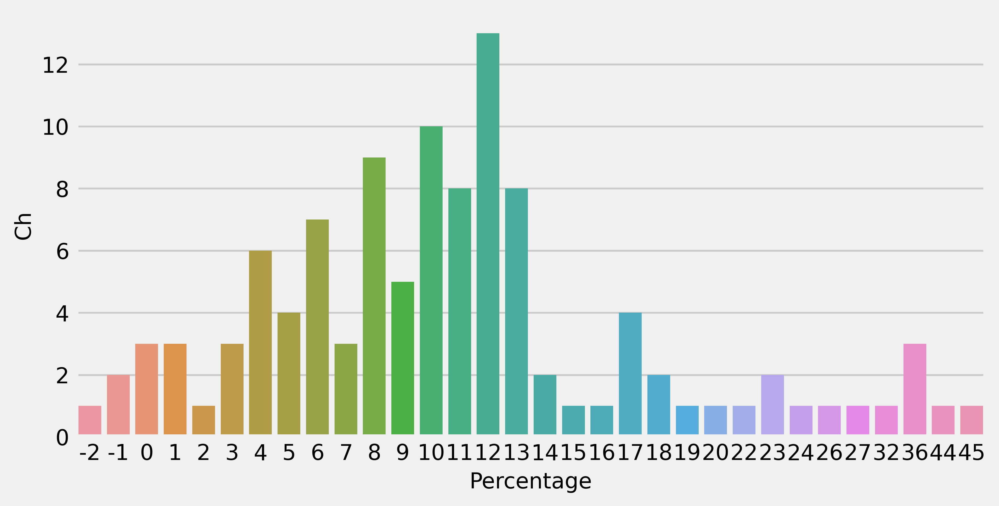

# Make High Quality Graphs
 Make beautiful, high quality graphs uing matplotlib and seaborn

## Requirements
* Python >= 3.4
* Matplotlib
* Seaborn
* Numpy
* Pandas

## Generating HD quality graphs

Include this code snippet in you plotting code and generate HD quality graphs.

```
%config InlineBackend.figure_format = 'retina'
plt.style.use('fivethirtyeight')
```

I am using "fivethirtyeight" stylesheet. Have a look at this.
```
https://matplotlib.org/3.1.1/gallery/style_sheets/fivethirtyeight.html
```


## Activation Function Plots

<p align="center">
  
  
 
</p>

## Bar Charts
<p align="center">
  
  
 
 
</p>
